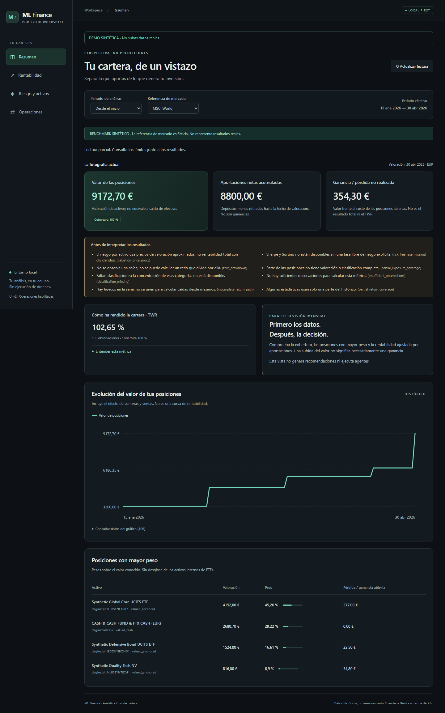
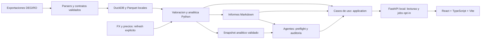

# ML Finance

**Entiende tu cartera. Prepara tu revision mensual.**

Una aplicacion local nacida para simplificar la revision de fin de mes de una
cartera DEGIRO: importar exportaciones, entender resultados y riesgos, simular
una aportacion y consultar agentes con trazabilidad para la revision manual.

**Hoy:** v2 local con **React + TypeScript + Vite / FastAPI / Python / DuckDB**.
La release etiquetada `v0.1.0` corresponde a la v1 historica; Streamlit se ha
retirado en #58. **No hay servicio publico desplegado**:
el repositorio es publico, los datos del usuario no.

> [!IMPORTANT]
> No ejecuta ordenes, no es un bot de trading ni un modelo de ML predictivo.
> Es apoyo analitico, no asesoramiento financiero. La IA no sustituye tu criterio.



*Captura de la aplicacion, no un mockup. Cartera, precios y benchmarks ficticios
de abril de 2026; los porcentajes no representan resultados de inversion.*

[Ver el recorrido breve (WebM)](docs/assets/showcase/walkthrough.webm) ·
[Capturas y guia de dos minutos](docs/showcase.md) ·
[Caso de estudio tecnico](docs/case_study.md)

## Del CSV a una revision informada

| Pregunta | Que puedes hacer hoy |
| --- | --- |
| ¿Que tengo y cuanto he aportado? | Importar transacciones, efectivo y snapshots DEGIRO; consultar posiciones y valor historico. |
| ¿Aportaciones o rentabilidad? | Separar flujos externos, PnL de posiciones abiertas, TWR y MWR/XIRR con explicaciones desplegables. |
| ¿Con que lo comparo? | Seleccionar MSCI World, S&P 500, 60/40 o efectivo €STR, con fuentes, cobertura y limites visibles. |
| ¿Donde se concentra el riesgo? | Consultar drawdown, volatilidad, pesos y correlaciones, sin convertir datos ausentes en ceros. |
| ¿Como simulo mi proxima aportacion? | Proponer compras sobre posiciones actuales y objetivos explicitos; sin ventas ni ordenes, con caja residual separada. |
| ¿Puedo revisar de donde sale una conclusion? | Leer informes Markdown, comprobaciones de calidad y auditoria de agentes: inputs, prompts, fuentes, outputs y hashes. |

La UI explica las metricas y ofrece detalle avanzado opcional. Su facilidad de
comprension en dos minutos es un objetivo de producto, **todavia no validado con usuarios**.

## Pruebalo con datos sinteticos

Requiere **Python 3.11 o posterior**, **Node.js 22.12 o posterior** y puertos
8000/5173 libres. La instalacion descarga dependencias; despues la demo funciona
offline, sin API keys. Desde la raiz, en PowerShell:

```powershell
python -m venv .venv
.\.venv\Scripts\python.exe -m pip install -r requirements.txt
$env:ML_FINANCE_ENV_FILE = "demo/synthetic_config/.env.demo"
.\.venv\Scripts\python.exe scripts/bootstrap_demo.py
.\.venv\Scripts\python.exe scripts/run_api.py --env-file demo/synthetic_config/.env.demo --operations demo
```

En otra terminal, desde la raiz:

```powershell
cd frontend
npm ci
npm run dev
```

Abre [ML Finance local](http://127.0.0.1:5173). La API escucha en
`127.0.0.1:8000`; Ctrl+C detiene cada proceso. Sin `--operations demo`, la API
es de solo lectura. No publiques los puertos ni los expongas mediante tuneles.

En POSIX crea y activa la venv (`python3 -m venv .venv`,
`source .venv/bin/activate`), instala `requirements.txt` y ejecuta:

```bash
ML_FINANCE_ENV_FILE=demo/synthetic_config/.env.demo python scripts/bootstrap_demo.py
python scripts/run_api.py --env-file demo/synthetic_config/.env.demo --operations demo
```

Los comandos npm son iguales. Windows es la ruta principal; CI prueba Python
3.11–3.14 en Windows y 3.12 en Ubuntu. macOS no tiene runner dedicado.

La demo usa copias editables en `demo/local_data/`. No subas CSV reales a ella.
Para regenerar las capturas publicables se usa una **copia temporal nueva**,
no tu directorio de demo: [procedimiento del showcase](docs/showcase.md).

## Arquitectura actual



El diagrama muestra el flujo de informacion. Las llamadas de UI/API/CLI entran
por `src/application/`, que coordina el dominio. React no calcula rentabilidad
ni guarda la cartera en localStorage. Los GET no descargan datos ni ejecutan
agentes. Las escrituras usan confirmacion, idempotencia y un unico worker local.

## Limites que importan

- **TWR**: encadena retornos ajustados por aportaciones/retiradas con la
  convencion de flujo al cierre; no es un TWR intradia exacto.
- **MWR/XIRR**: rentabilidad anualizada ponderada por fechas e importes de
  flujos; no es directamente comparable con un TWR acumulado.
- **Benchmarks**: en modo real necesitan descarga explicita de proxies ETF y
  BCE a cache. Un proxy no es el indice oficial. Nunca se usa la serie
  sintetica como respaldo de datos reales.
- **Riesgo**: muestra y cobertura condicionan los resultados. Sharpe/Sortino
  requieren tasa explicita; esta UI no la configura. Faltantes y avisos se muestran.
- **Agentes**: `static/null` es el baseline offline; `static/static` añade
  busqueda sintetica. OpenAI/Tavily/DuckDuckGo son opciones externas explicitas
  que pueden transmitir contexto privado. Una auditoria no garantiza acierto.

## Tu cartera privada y la v1

Para usar datos reales, sigue [la guia de API](docs/local_api.md) y
[operaciones locales](docs/local_jobs.md). No mezcles escrituras de CLI,
y el worker. Los CSV, bases, informes y auditorias reales quedan en
rutas ignoradas por Git; consulta [privacidad](docs/privacy.md) antes de compartir.

Si venias de la v1, consulta la [migracion a React](docs/react_migration.md).
Publicar una aplicacion multiusuario requiere trabajo adicional de seguridad,
aislamiento y despliegue; no forma parte de esta demo local.

## Documentacion y desarrollo

Tras instalar `requirements-dev.txt`, ejecuta `.\scripts\test.ps1` (o
`.\.venv\Scripts\python.exe -m pytest`). Para refrescar FX/precios por CLI,
consulta [scripts](scripts/README.md); no lo ejecutes mientras el worker escribe.

- [Demo sintetica](demo/README.md) y [frontend](frontend/README.md): arranque y uso.
- [Caso de estudio](docs/case_study.md): decisiones de arquitectura y evidencias.
- [TWR/MWR](docs/performance.md), [benchmarks](docs/benchmarks.md) y
  [riesgo](docs/risk_analytics.md): formulas, cobertura y limites.
- [Pipeline mensual](docs/monthly_pipeline.md), [agentes](src/agents/README.md)
  y [paridad React](docs/react_operations.md): flujo y auditoria.
- [Arquitectura actual](docs/architecture.md), [API](docs/local_api.md)
  y [roadmap](docs/roadmap.md): presente y siguientes pasos.
- [CONTRIBUTING](CONTRIBUTING.md): `requirements-dev.txt`, tests, cobertura,
  lint, tipos, secretos, build y auditoria de dependencias.
- [AGENTS.md](AGENTS.md): instrucciones para agentes de programacion.
- [Seguridad](SECURITY.md), [conducta](CODE_OF_CONDUCT.md) y
  [changelog](CHANGELOG.md).

Licencia [MIT](LICENSE). Primera release local: tag `v0.1.0`.
