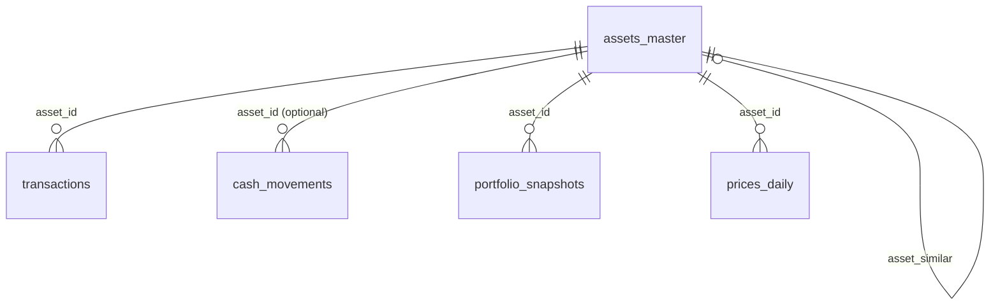

# Modelo de datos

## Objetivo

Este documento define el esquema inicial de DuckDB para `ML_finance`.
Cubre las tablas minimas pedidas en la issue `#1 [P1-01]` y deja fijado el
contrato para las siguientes fases:

- importadores DEGIRO
- reconstruccion historica de cartera
- enriquecimiento con market data
- generacion de informes

El DDL ejecutable vive en `src/data/sql/001_initial_schema.sql`.

## Principios de modelado

1. Las exportaciones del broker siguen siendo la fuente de verdad.
2. El esquema guarda datos normalizados, no el layout raw de los CSV.
3. Los identificadores internos son claves de texto estables generadas por la
   capa de importacion.
4. Los importes se conservan en moneda original y pueden incluir columnas
   opcionales de moneda base cuando el broker o un proceso posterior aporte la
   conversion.
5. Las tablas importadas conservan trazabilidad con campos como
   `source_file`, `source_row` y `external_reference`.

## Resumen de tablas

| Tabla | Grano | Clave primaria |
| --- | --- | --- |
| `assets_master` | una fila por activo normalizado | `asset_id` |
| `transactions` | una fila por transaccion de broker que afecta posicion | `transaction_id` |
| `cash_movements` | una fila por movimiento de efectivo | `cash_movement_id` |
| `portfolio_snapshots` | una fila por activo y fecha de snapshot | `snapshot_id` |
| `prices_daily` | una fila por activo, fecha y proveedor | `(asset_id, price_date, price_provider)` |
| `fx_rates` | una fila por par de divisas, fecha y proveedor | `(base_currency, quote_currency, rate_date, rate_provider)` |
| `reports_history` | una fila por artefacto de informe generado | `report_id` |

## Definicion de tablas

### `assets_master`

Tabla de referencia para instrumentos negociables y cualquier activo que pueda
aparecer en transacciones, snapshots o market data.

Campos relevantes:

- `asset_id`: identificador canonico interno.
- `asset_type`: categoria general como `stock`, `etf`, `fund`, `cash`, `bond`
  o `crypto`.
- `asset_name`: nombre normalizado.
- `asset_similar`: activo proxy opcional para cubrir casos en los que no se
  pueda obtener market data fiable del activo original pero si de otro activo
  suficientemente parecido.
- `isin`, `ticker`, `broker_symbol`, `exchange_mic`: identificadores utiles
  para enlazar broker y proveedores externos con el mismo activo.
- `trading_currency`: moneda de cotizacion del activo.
- `first_seen_date`, `last_seen_date`, `is_active`: ciclo de vida basico.

Papel relacional:

- tabla padre de `transactions`
- tabla padre opcional de `cash_movements`
- tabla padre de `portfolio_snapshots`
- tabla padre de `prices_daily`
- autorrelacion opcional de `asset_similar -> asset_id`

### `transactions`

Transacciones normalizadas del broker que cambian una posicion en un activo.
El caso inicial esperado es compra/venta, dejando margen para ampliar tipos en
futuras migraciones si hiciera falta.

Campos relevantes:

- `transaction_id`: identificador canonico del evento normalizado.
- `asset_id`: clave foranea a `assets_master`.
- `transaction_type`: valores iniciales esperados `BUY` y `SELL`.
- `trade_date`, `settlement_date`: fecha economica y fecha de liquidacion.
- `quantity`: siempre positiva.
- `unit_price`, `gross_amount`, `fees_amount`, `taxes_amount`: importes
  absolutos en `transaction_currency`.
- `net_cash_amount`: impacto firmado sobre la cuenta del broker.
- `base_currency`, `fx_rate_to_base`, `net_cash_amount_base`: conversion
  opcional a moneda base.
- `external_reference`, `source_file`, `source_row`: trazabilidad y soporte
  para deduplicacion.

### `cash_movements`

Eventos normalizados de efectivo que no representan directamente una compra o
venta. Ejemplos: ingresos, retiradas, dividendos, impuestos, comisiones o
intereses.

Campos relevantes:

- `cash_movement_id`: identificador canonico.
- `asset_id`: clave foranea nullable para eventos ligados a un activo, como un
  dividendo o una retencion.
- `movement_type`: categoria semantica del movimiento.
- `amount`: importe firmado en `movement_currency`.
- `value_date`: fecha de valor opcional.
- `amount_base` y `fx_rate_to_base`: conversion opcional.
- `external_reference`, `source_file`, `source_row`: trazabilidad.

### `portfolio_snapshots`

Estado puntual de la cartera por activo y fecha.
La tabla esta pensada para aceptar tanto snapshots importados del broker como
snapshots reconstruidos despues a partir de transacciones y market data.

Campos relevantes:

- `snapshot_id`: identificador canonico.
- `snapshot_date`: fecha efectiva del snapshot.
- `snapshot_source`: origen de la fila, por ejemplo `broker_export` o
  `reconstructed_daily`.
- `asset_id`: clave foranea a `assets_master`.
- `quantity`: posicion en esa fecha.
- `average_cost`, `market_price`, `market_value`: valores opcionales en
  `position_currency`.
- `market_value_base`, `unrealized_pnl_base`: metricas opcionales en moneda
  base.
- `source_file`, `source_row`: trazabilidad para snapshots importados.

### `prices_daily`

Precios diarios por activo y proveedor.

Campos relevantes:

- clave primaria compuesta `(asset_id, price_date, price_provider)`.
- `close_price` es obligatorio porque es el minimo necesario para valorar la
  cartera a cierre diario.
- `adjusted_close_price` es opcional para proveedores con ajustes por splits o
  dividendos.
- `price_currency` registra la moneda de cotizacion devuelta por el proveedor.

### `fx_rates`

Tipos de cambio diarios por proveedor.

Campos relevantes:

- clave primaria compuesta
  `(base_currency, quote_currency, rate_date, rate_provider)`.
- `rate` significa cuantas unidades de `quote_currency` equivalen a una unidad
  de `base_currency` en `rate_date`.

Ejemplo:

- `base_currency = EUR`
- `quote_currency = USD`
- `rate = 1.08`

significa `1 EUR = 1.08 USD`.

### `reports_history`

Metadatos de informes generados, no el contenido del informe.
Sirve para reproducibilidad, historico y futuras automatizaciones.

Campos relevantes:

- `report_id`: identificador canonico.
- `report_type`: semanal, mensual, asignacion, performance, etc.
- `report_period_start`, `report_period_end`, `as_of_date`: cobertura del
  informe.
- `report_path`: ruta del artefacto generado, normalmente un Markdown bajo
  `src/data/local/reports/`.
- `report_format`: valor inicial por defecto `md`.
- `status`: resultado de la generacion, por ejemplo `generated` o `failed`.
- `parameters_json`: parametros serializados si interesa trazarlos.
- `report_hash`: checksum opcional para reproducibilidad o deteccion de
  cambios.

## Relaciones

`fx_rates` y `reports_history` no necesitan claves foraneas directas en esta
primera version. Se relacionan logicamente por divisa, periodos y fechas de
snapshot.

## Convenciones de signo

- `transactions.quantity` siempre es positiva.
- `transactions.gross_amount`, `fees_amount` y `taxes_amount` se guardan como
  importes absolutos.
- `transactions.net_cash_amount` va firmado desde la perspectiva de la cuenta
  del broker.
- `cash_movements.amount` va firmado desde la perspectiva de la cuenta del
  broker.

## Preparacion para el importador DEGIRO

El esquema deja preparado el terreno para la siguiente fase sin congelar aun
un contrato raw demasiado pronto.

Puntos ya cubiertos:

- campos de trazabilidad de broker en las tablas importables
- fechas de liquidacion y de valor
- columnas opcionales para conversion a moneda base
- `snapshot_source` para convivir con snapshots importados y reconstruidos
- tablas de precios y FX conscientes del proveedor desde el inicio

Fuera de alcance de esta issue:

- implementacion de parsers
- tablas raw de aterrizaje
- orquestacion de importaciones
- utilidades de rutas y entorno de `P1-02`
- fixtures sinteticos de `P1-03`
