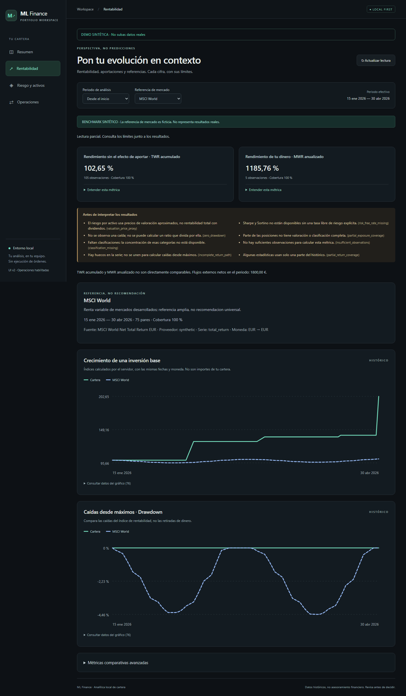
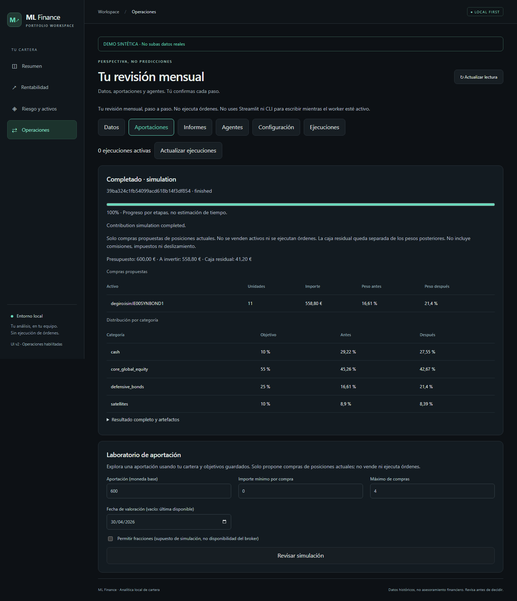
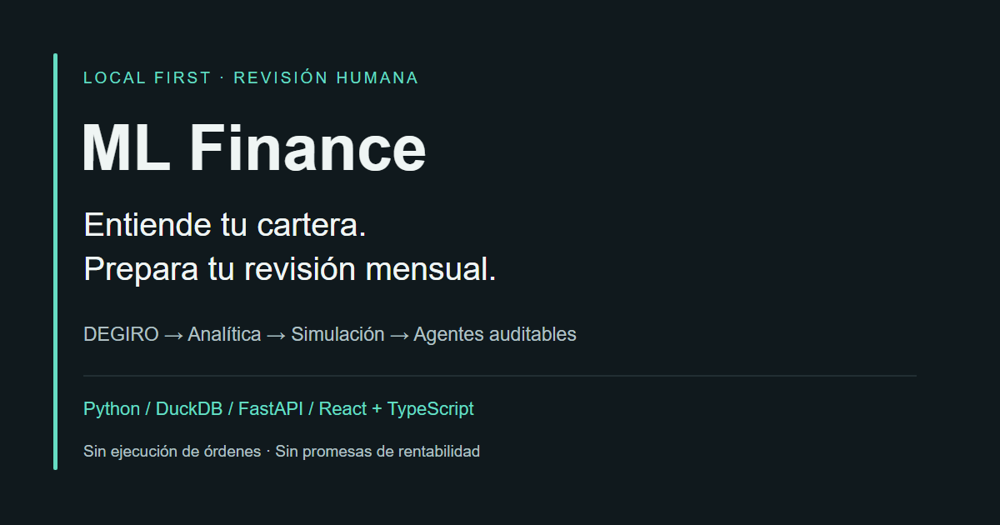

# Showcase v2: demo real, datos ficticios

## Recorrido de dos minutos

1. **Resumen**: distingue valor de posiciones, aportaciones y resultado;
   abre una explicacion de metrica. El valor historico no es rentabilidad.
2. **Rentabilidad**: consulta TWR y MWR, selecciona un benchmark y revisa
   periodo, cobertura y avisos. Los porcentajes de esta demo no son un track record.
3. **Operaciones → Aportaciones**: simula 600 EUR con fecha 2026-04-30;
   revisa y confirma los parametros. Mira compras propuestas y caja residual.
   No se envia ninguna orden.
4. Para profundizar: informes, agentes `static/null`, auditoria y
   [caso de estudio](case_study.md). El monitor sin busqueda puede quedar `partial`.

El [video WebM](assets/showcase/walkthrough.webm) registra las tres primeras
pantallas sobre la API real local. No es un prototipo ni hay respuestas HTTP simuladas.
La comprension en dos minutos es un objetivo, no un resultado de prueba de usuarios.

## Capturas

Todas son capturas completas sin retoque ni eliminacion de avisos. Los importes,
activos, precios y benchmarks son sinteticos. Fecha de valoracion: 2026-04-30.

### Resumen


### Rentabilidad y limites



### Simulacion, nunca ejecucion de ordenes



## Regenerar sin acceder a datos privados

Instala `requirements-dev.txt`, ejecuta `npm ci` en `frontend/` y deja libres
los puertos 8000/5173. Desde `frontend/`:

```bash
npx playwright install chromium
npm run showcase
```

La instalacion necesita red; la captura no. Playwright lanza Vite y
`scripts/run_frontend_e2e_api.py`, que copia exclusivamente configuracion/CSVs
sinteticos y schema SQL en una carpeta nueva bajo `.test_tmp/`. No carga `.env`
ni reutiliza `demo/local_data/` ni servidores existentes. Backend y navegador
bloquean peticiones externas; no se habilitan proveedores reales.

Salida: `frontend/test-results/showcase/`, ignorada por Git. Incluye tres PNG,
un video WebM, portada PNG y `manifest.json` con hashes de entradas y salidas.
El SVG fuente de la portada vive en `docs/assets/showcase/`.
Tiempos de jobs, fuentes del sistema y codificacion del video pueden variar:
se reproduce el recorrido, no se promete igualdad binaria entre sistemas.

Antes de sustituir los assets versionados:

1. Revisa las tres imagenes y el video completos: solo datos sinteticos,
   sin rutas locales, terminales, cuentas, prompts o auditorias privadas.
2. Copia exclusivamente los seis archivos generados a `docs/assets/showcase/`.
   No publiques trazas Playwright, bases, logs ni el directorio temporal.
3. Ejecuta `python -m pytest tests/test_public_documentation.py` y el escaner
   documentado en [privacidad](privacy.md), incluyendo los nuevos archivos.
   Los hashes verifican integridad, **no privacidad**; el escaner no hace OCR.

CI comprueba enlaces locales, scripts, hashes, dimensiones y regeneracion
offline del recorrido. No sustituye la revision visual ni actualiza assets automaticamente.

## Portada para compartir



[PNG 1200 × 630](assets/showcase/social-preview.png), preparado para LinkedIn o
la social preview de GitHub; [SVG editable](assets/showcase/social-preview.svg).
Es una portada editorial, no una captura ni una promesa de funciones futuras.
Su subida a LinkedIn/GitHub es manual; generar el archivo no cambia esos perfiles.

## Estado del producto

V1: Streamlit disponible. V2: React/FastAPI local con analitica y operaciones
opt-in. Futuro: revisar paridad y retirada de Streamlit (#58); un despliegue
publico o multiusuario no esta implementado ni habilitado por esta demo.
